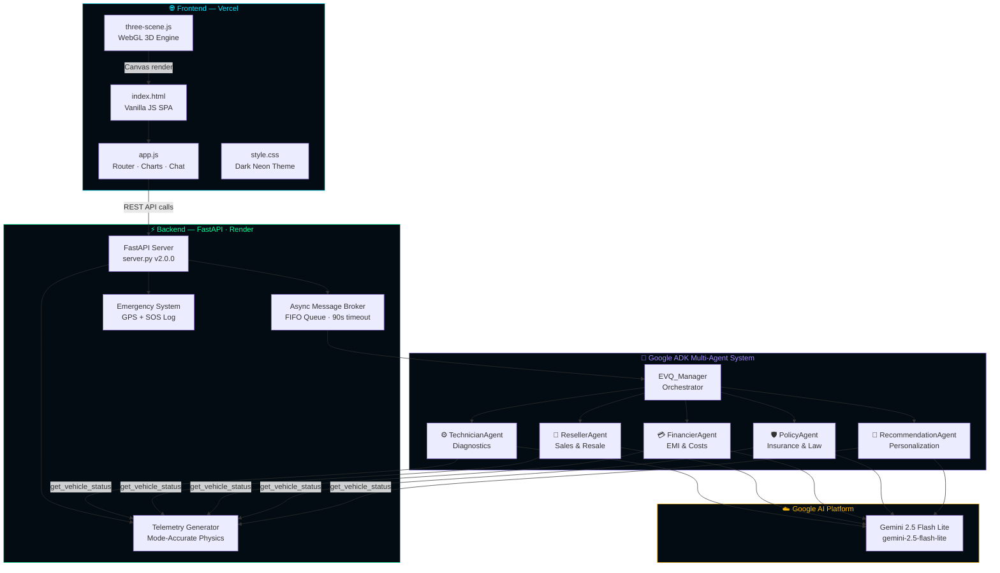
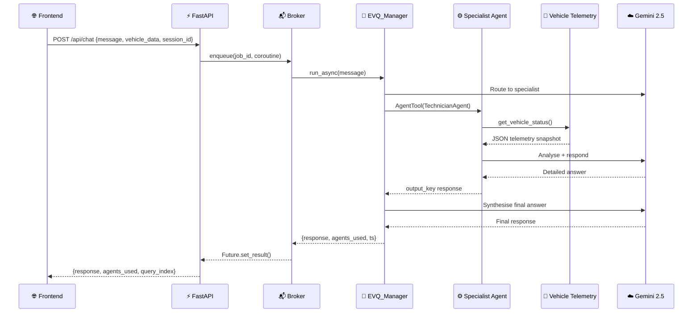
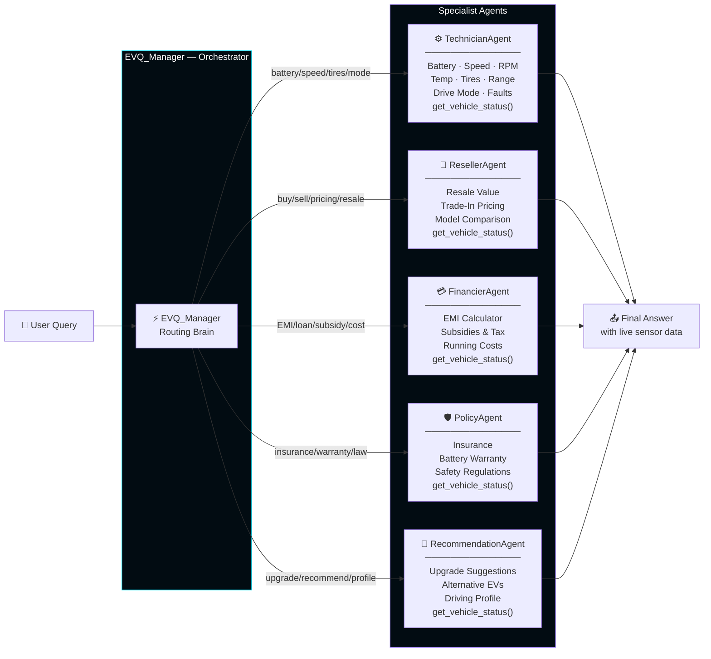
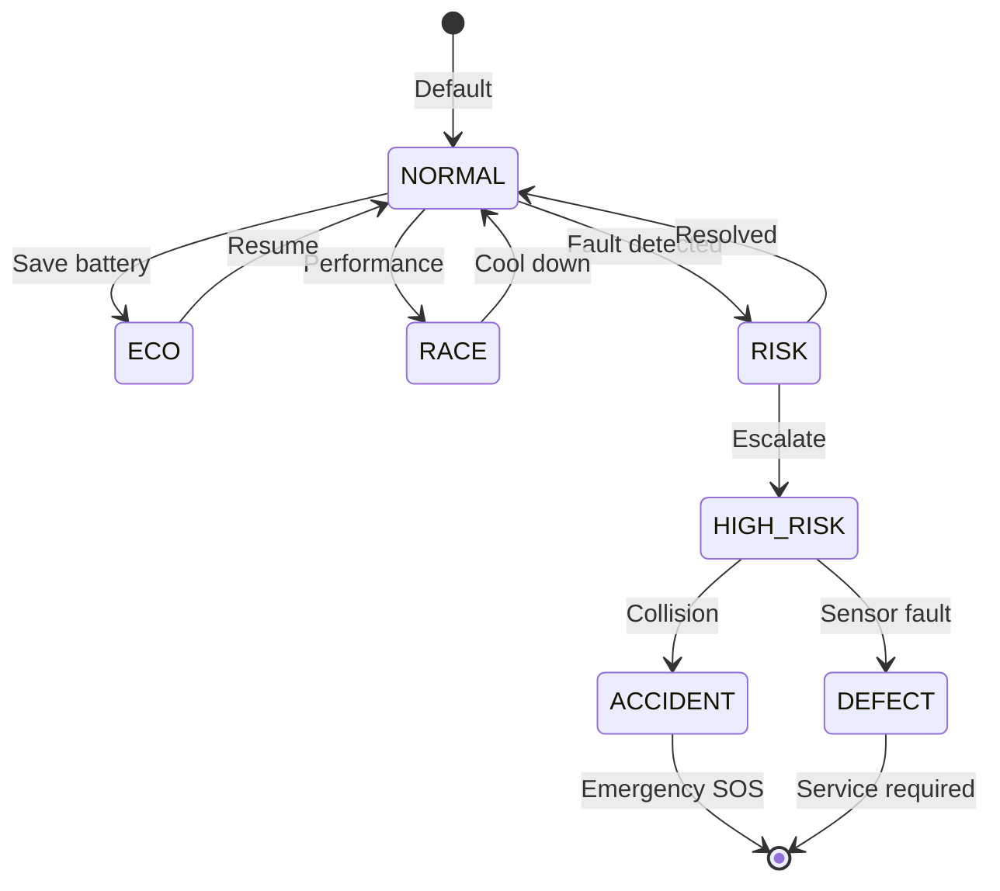
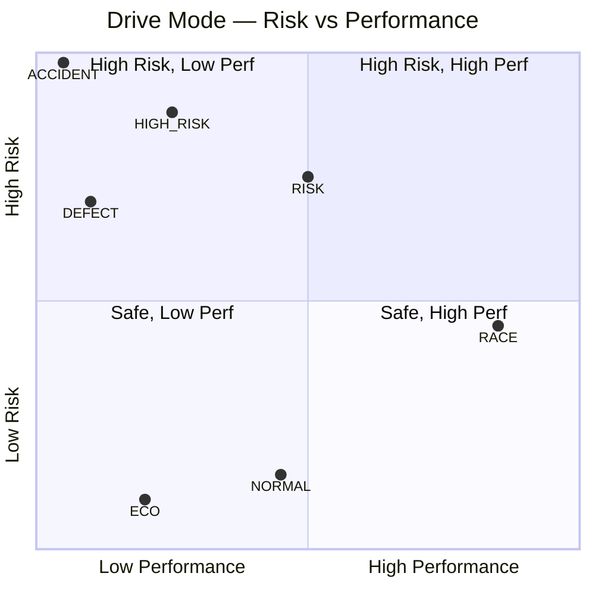
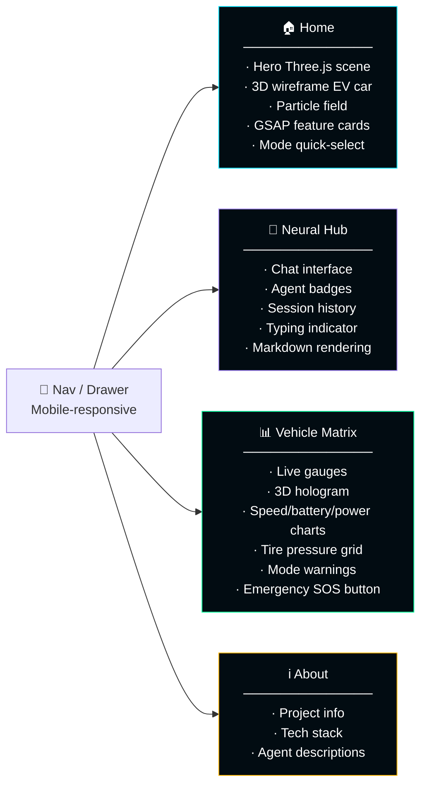
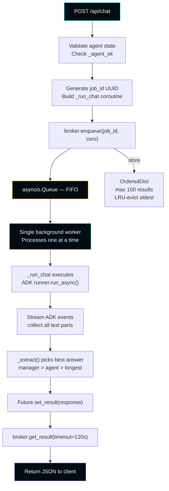
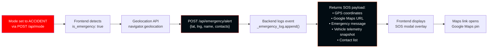
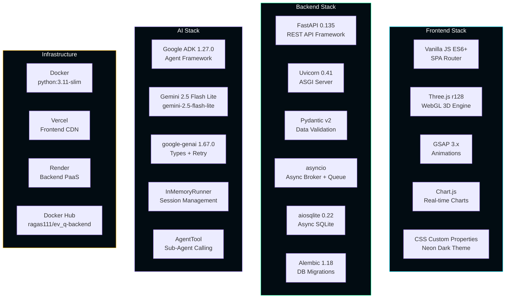

<div align="center">

```
███████╗██╗   ██╗       ██████╗     ██████╗
██╔════╝██║   ██║      ██╔═══██╗   ██╔═══██╗
█████╗  ██║   ██║      ██║   ██║   ██║   ██║
██╔══╝  ╚██╗ ██╔╝      ██║▄▄ ██║   ██║▄▄ ██║
███████╗ ╚████╔╝    ██╗╚██████╔╝██╗╚██████╔╝
╚══════╝  ╚═══╝     ╚═╝ ╚══▀▀═╝ ╚═╝ ╚══▀▀═╝
```

### ⚡ *The Future of EV Intelligence — Live Inside Your Vehicle* ⚡

<br/>

[](https://ev-q-smart-ev-system.vercel.app/)
[](https://ev-q-smart-ev-system.onrender.com)
[](https://hub.docker.com/repository/docker/ragas111/ev_q-backend)

<br/>


<br/>

> **EV_Q** is an AI-powered Smart Electric Vehicle management system featuring real-time telemetry,  
> a multi-agent AI assistant, emergency SOS, 7 intelligent drive modes, and a WebGL holographic 3D dashboard —  
> all running live and embedded inside a vehicle's digital cockpit.

<br/>

---

</div>

<br/>

## 🗺️ Table of Contents

- [✨ Feature Overview](#-feature-overview)
- [🏗️ System Architecture](#️-system-architecture)
- [🧠 Multi-Agent AI System](#-multi-agent-ai-system)
- [🚗 Drive Modes & Telemetry](#-drive-modes--telemetry)
- [📡 REST API Reference](#-rest-api-reference)
- [📊 Analytics & Metrics](#-analytics--metrics)
- [🎨 Frontend & 3D Engine](#-frontend--3d-engine)
- [🐳 Docker Deployment](#-docker-deployment)
- [⚙️ Local Development Setup](#️-local-development-setup)
- [🔐 Environment Variables](#-environment-variables)
- [🔄 Data Flow & Message Broker](#-data-flow--message-broker)
- [🚨 Emergency SOS System](#-emergency-sos-system)
- [📦 Tech Stack](#-tech-stack)

<br/>

---

## ✨ Feature Overview

<br/>

```
╔══════════════════════╦══════════════════════╦══════════════════════╗
║  🧠 5 AI AGENTS      ║  📡 LIVE TELEMETRY   ║  🎮 7 DRIVE MODES    ║
║  Gemini-Powered      ║  18+ Sensor Fields   ║  ECO → ACCIDENT      ║
╠══════════════════════╬══════════════════════╬══════════════════════╣
║  🌐 3D HOLOGRAM      ║  🚨 EMERGENCY SOS    ║  ⚡ ASYNC BROKER     ║
║  Three.js WebGL      ║  GPS + Auto-Dispatch  ║  Rate-Limit Safe     ║
╠══════════════════════╬══════════════════════╬══════════════════════╣
║  📊 LIVE CHARTS      ║  🔧 FAULT DETECTION  ║  🐳 DOCKER READY     ║
║  Chart.js Realtime   ║  TPMS + BMS Codes    ║  One-Command Deploy  ║
╚══════════════════════╩══════════════════════╩══════════════════════╝
```

<br/>

| Feature | Description | Status |
|---|---|---|
| 🧠 Multi-Agent AI | 5 specialist Gemini agents orchestrated by EVQ_Manager | ✅ Live |
| 📡 Real-Time Telemetry | 18+ fields: speed, battery, RPM, tire pressure, efficiency | ✅ Live |
| 🏎️ Drive Mode Simulation | 7 modes with spec-accurate physics simulation | ✅ Live |
| 🌐 WebGL 3D Dashboard | Wireframe EV car, orbit rings, particle fields in Three.js | ✅ Live |
| 🚨 Emergency SOS | GPS-based collision detection + auto-contact dispatch | ✅ Live |
| ⚡ Async Message Broker | FIFO queue decoupling HTTP from Gemini rate limits | ✅ Live |
| 📊 Real-Time Charts | Speed, battery, power trend charts via Chart.js | ✅ Live |
| 🔧 Fault Detection | TPMS sensor fault, BMS imbalance, motor temp codes | ✅ Live |
| 🎨 GSAP Animations | Page transitions, gauges, badge counters | ✅ Live |
| 🐳 Docker | Containerized backend, single-command deploy | ✅ Live |

<br/>

---

## 🏗️ System Architecture

<br/>



<br/>

### 🔁 Request Lifecycle



<br/>

---

## 🧠 Multi-Agent AI System

EV_Q uses **Google ADK 1.27.0** to orchestrate a hierarchy of specialist AI agents, each powered by **Gemini 2.5 Flash Lite**. Every agent has access to the live `get_vehicle_status()` tool so they always work with real sensor data.

<br/>



<br/>

### Agent Routing Table

| Query Type | Routed Agent | Tool Called | Output Key |
|---|---|---|---|
| Battery, speed, temp, tires, drive mode, RPM | `TechnicianAgent` | `get_vehicle_status()` | `tech_support_response` |
| Resale value, trade-in, model comparison | `ResellerAgent` | `get_vehicle_status()` | `reseller_recommendation` |
| EMI, loan, running cost, subsidies | `FinancierAgent` | `get_vehicle_status()` | `finance_calculation` |
| Insurance, warranty, policy, regulations | `PolicyAgent` | `get_vehicle_status()` | `policy_guidance` |
| Upgrade suggestions, alternative EVs | `RecommendationAgent` | `get_vehicle_status()` | `personalized_recommendation` |

<br/>

### 🔍 Agent Event Extraction Logic

The `_extract()` engine processes raw ADK event streams using a best-text strategy:

```
ADK Event Stream
       │
       ├── function_call  → track agent name + hits counter
       ├── function_response → extract buried sub-agent output
       └── text parts     → collect (author, text) tuples
                                      │
                          ┌───────────┴───────────┐
                    manager_texts             agent_texts
                          │                        │
                    Last mgr text            Longest agent text
                    if len > 50               (fallback)
                          └───────────┬───────────┘
                                 Best Answer
```

<br/>

---

## 🚗 Drive Modes & Telemetry

EV_Q simulates **7 physics-accurate drive modes**, each with distinct telemetry profiles, tire behavior, and visual themes:

<br/>



<br/>

### Drive Mode Specifications

| Mode | Icon | Speed (km/h) | Power (kW) | RPM | Bat Temp (°C) | Range Mult | Drain Mult | Theme |
|---|:---:|---|---|---|---|---|---|---|
| **ECO** | 🌿 | 30–60 | 15–35 | 1500–2500 | 24–28 | ×1.45 | ×0.4 | 🟢 Green |
| **NORMAL** | ⚡ | 40–90 | 40–70 | 2500–4000 | 26–32 | ×1.0 | ×1.0 | 🔵 Cyan |
| **RACE** | 🏎️ | 80–180 | 120–250 | 5000–9000 | 35–45 | ×0.45 | ×2.2 | 🟠 Orange |
| **RISK** | ⚠️ | 30–140 | 20–160 | 1000–7000 | 32–48 | ×0.6 | ×1.8 | 🟡 Yellow |
| **HIGH_RISK** | 🔴 | 0–60 | 5–40 | 0–3000 | 46–65 | ×0.25 | ×2.8 | 🔴 Red |
| **ACCIDENT** | 🚨 | 0 | 0 | 0 | 55–75 | ×0.0 | ×3.5 | 🆘 Emergency |
| **DEFECT** | 🔧 | 0–20 | 2–15 | 0–1200 | 28–40 | ×0.3 | ×1.5 | 🟣 Purple |

<br/>

### Tire Pressure Behavior by Mode

| Mode | FL (PSI) | FR (PSI) | RL (PSI) | RR (PSI) | Behavior |
|---|---|---|---|---|---|
| ECO | 33.0 | 33.2 | 33.1 | 33.0 | Stable ±0.3 PSI |
| NORMAL | 32.7 | 32.5 | 32.8 | 32.6 | Normal ±0.5 PSI |
| RACE | 34.8 | 35.1 | 35.5 | 35.3 | Heat-expanded, fast fluctuation |
| RISK | 31.2 | 32.4 | **30.8↓** | 32.0 | **RL losing pressure gradually** |
| HIGH_RISK | **28.0↓** | 31.5 | **29.3↓** | 31.0 | **FL + RL critically low** |
| ACCIDENT | **~2.0** | **~10.0** | **~0.0** | **~8.0** | Near-zero from impact |
| DEFECT | **ERR** | 32.0 | **ERR** | 32.0 | TPMS sensor fault FL + RL |

<br/>

### 📡 Full Telemetry Payload — `GET /api/vehicle/status`

```jsonc
{
  // ── Core Metrics ─────────────────────────────────────────────────────
  "speed":              62.4,          // km/h — mode-accurate wave oscillation
  "battery_level":      74.3,          // % — time-draining per mode drain_mult
  "battery_health":     93.1,          // % — degrades in ACCIDENT/HIGH_RISK
  "battery_temp":       29.5,          // °C — per-mode thermal range
  "motor_rpm":          3240,          // RPM — speed-proportional
  "range_km":           215,           // km — battery_level × 3.85 × range_mult
  "power_kw":           54.2,          // kW — mode-accurate oscillation
  "efficiency":         9.1,           // kWh/100km
  "cabin_temp":         22.3,          // °C — +3 in RACE/HIGH_RISK
  "odometer":           12591,         // km — incrementing

  // ── Charging & Regen ─────────────────────────────────────────────────
  "regen_active":       true,          // regenerative braking above threshold
  "charging":           false,         // true when battery_level < 18%
  "regen_braking_active": true,

  // ── Tire Pressures ───────────────────────────────────────────────────
  "tire_pressures": {
    "FL": 32.7, "FR": 32.5,           // PSI — mode-specific scenarios
    "RL": 32.8, "RR": 32.6            // "ERR" string in DEFECT mode
  },

  // ── Drive Mode ────────────────────────────────────────────────────────
  "drive_mode":         "NORMAL",
  "gauge_theme":        "cyan",
  "mode_color":         "#00e5ff",
  "mode_icon":          "⚡",
  "mode_description":   "Normal mode — balanced performance.",
  "mode_warnings":      [],

  // ── Status Labels (for AI agent context) ─────────────────────────────
  "battery_status":       "GOOD",
  "battery_health_status":"EXCELLENT ✅",
  "battery_temp_status":  "OPTIMAL ✅",
  "range_status":         "GOOD ✅",
  "speed_label":          "CITY",
  "tire_mode":            "normal",
  "tire_warn_positions":  "",

  // ── Safety Flags ──────────────────────────────────────────────────────
  "puncture_alert":     false,         // true when PSI < 30 AND speed > 90
  "is_emergency":       false,
  "is_fault":           false,

  // ── Metadata ──────────────────────────────────────────────────────────
  "timestamp":          "2025-08-14 18:32:11"
}
```

<br/>

---

## 📡 REST API Reference

**Base URL (Production):** `https://ev-q-smart-ev-system.onrender.com`

<br/>

### System Endpoints

| Method | Endpoint | Description | Auth |
|---|---|---|---|
| `GET` | `/` | Health check — returns agent status, version | None |
| `GET` | `/api/debug` | Full debug info — agent state, API key length, runner methods | None |
| `POST` | `/api/reinit` | Hot-reload all AI agents without server restart | None |
| `GET` | `/api/stats` | Query count, agent hits, model info, session size | None |
| `GET` | `/api/agents` | List all 5 specialist agents with metadata & query counts | None |

<br/>

#### `GET /` — Health Check

```http
GET https://ev-q-smart-ev-system.onrender.com/
```

```json
{
  "status": "online",
  "agents": true,
  "version": "2.0.0",
  "error": null
}
```

<br/>

#### `GET /api/stats` — System Metrics

```http
GET /api/stats
```

```json
{
  "total_queries": 142,
  "agents_active": 5,
  "model": "Gemini 2.5 Flash Lite",
  "version": "2.0.0",
  "agent_hits": {
    "TechnicianAgent": 87,
    "ResellerAgent": 21,
    "FinancierAgent": 15,
    "PolicyAgent": 11,
    "RecommendationAgent": 8
  },
  "status": "online",
  "messages": 284
}
```

<br/>

#### `GET /api/agents` — Agent Registry

```http
GET /api/agents
```

```json
{
  "agents": [
    { "id": "TechnicianAgent", "icon": "⚙️", "color": "#00e5ff",
      "role": "Technical Support", "queries": 87 },
    { "id": "ResellerAgent",   "icon": "🚗", "color": "#00ff9d",
      "role": "Sales & Resale",    "queries": 21 },
    { "id": "FinancierAgent",  "icon": "💳", "color": "#ffb800",
      "role": "Finance & EMI",     "queries": 15 },
    { "id": "PolicyAgent",     "icon": "🛡️","color": "#ff6b35",
      "role": "Policy & Legal",    "queries": 11 },
    { "id": "RecommendationAgent","icon":"🧠","color":"#a78bfa",
      "role": "Personalization",   "queries": 8  }
  ]
}
```

<br/>

---

### Vehicle Telemetry Endpoints

| Method | Endpoint | Description | Body |
|---|---|---|---|
| `GET` | `/api/vehicle/status` | Generate & return live telemetry snapshot | — |
| `POST` | `/api/vehicle/update` | Push frontend-side telemetry to backend agent context | `{"vehicle_data": {...}}` |

<br/>

#### `GET /api/vehicle/status` — Full Telemetry

```http
GET /api/vehicle/status
```

Returns the complete 25-field telemetry object (see Full Telemetry Payload above). Each call generates a fresh physics-simulated snapshot based on the active drive mode.

<br/>

#### `POST /api/vehicle/update` — Sync Frontend State to Agents

Keeps the backend `_vehicle_state` in sync with the frontend's locally-polled telemetry, ensuring agents always see the exact data the dashboard is displaying.

```http
POST /api/vehicle/update
Content-Type: application/json

{
  "vehicle_data": {
    "speed": 74.2,
    "battery_level": 68.5,
    "battery_temp": 31.0,
    "drive_mode": "RACE",
    ...
  }
}
```

```json
{ "ok": true }
```

<br/>

---

### Drive Mode Endpoints

| Method | Endpoint | Description | Body |
|---|---|---|---|
| `GET` | `/api/mode` | Get active mode + full profile + all available modes | — |
| `POST` | `/api/mode` | Switch drive mode. Invalidates cached telemetry | `{"mode": "ECO"}` |

<br/>

#### `GET /api/mode` — Current Mode

```http
GET /api/mode
```

```json
{
  "mode": "NORMAL",
  "profile": {
    "speed_range": [40, 90],
    "power_range": [40, 70],
    "rpm_range": [2500, 4000],
    "bat_temp_range": [26, 32],
    "efficiency_range": [8.0, 10.0],
    "bat_drain_mult": 1.0,
    "range_mult": 1.0,
    "color": "#00e5ff",
    "icon": "⚡",
    "description": "Normal mode — balanced performance.",
    "warnings": [],
    "emergency": false,
    "fault": false
  },
  "all_modes": ["ECO", "NORMAL", "RACE", "RISK", "HIGH_RISK", "ACCIDENT", "DEFECT"]
}
```

<br/>

#### `POST /api/mode` — Switch Drive Mode

```http
POST /api/mode
Content-Type: application/json

{ "mode": "RACE" }
```

```json
{
  "ok": true,
  "mode": "RACE",
  "profile": {
    "speed_range": [80, 180],
    "power_range": [120, 250],
    "bat_drain_mult": 2.2,
    "color": "#ff6b35",
    "icon": "🏎️",
    "warnings": ["⚠️ High battery temperature", "⚠️ Rapid power draw"]
  }
}
```

> **Validation:** Invalid mode names return `HTTP 400` with a list of valid modes.

<br/>

---

### AI Chat Endpoints

| Method | Endpoint | Description | Body |
|---|---|---|---|
| `POST` | `/api/chat` | Send message to the multi-agent AI system | `{"message": "...", "session_id": "...", "vehicle_data": {...}}` |

<br/>

#### `POST /api/chat` — Chat with EV_Q AI

The chat endpoint uses an **async message broker** to queue requests, preventing Gemini rate limit pile-ups. The backend awaits the result (up to 120 seconds) before responding.

```http
POST /api/chat
Content-Type: application/json

{
  "message": "What's the current battery status and how long until I need to charge?",
  "session_id": "550e8400-e29b-41d4-a716-446655440000",
  "vehicle_data": {
    "battery_level": 42.1,
    "range_km": 118,
    "drive_mode": "NORMAL"
  }
}
```

```json
{
  "response": "⚙️ TechnicianAgent — Battery Status Report\n\n**Battery Level: 42.1% — OK**\n- Range remaining: 118 km\n- Battery temp: 28.3°C — OPTIMAL ✅\n- Battery health: 93.4% — EXCELLENT ✅\n\nAt your current NORMAL mode consumption, you have approximately 118 km before hitting the recommended 20% charge threshold. I suggest charging within the next 60–70 km for comfortable margin.",
  "agents_used": ["TechnicianAgent"],
  "query_index": 47,
  "session_id": "550e8400-e29b-41d4-a716-446655440000",
  "ts": "2025-08-14T18:44:22.831"
}
```

**Error Responses:**

| HTTP Code | Condition |
|---|---|
| `503` | Agents not initialised — check `/api/debug` |
| `504` | Request timed out in queue (>120s) |
| `500` | Internal agent processing error |

<br/>

---

### Emergency SOS Endpoints

| Method | Endpoint | Description | Body |
|---|---|---|---|
| `POST` | `/api/emergency/alert` | Trigger emergency SOS with GPS coordinates | `EmergencyAlertRequest` |
| `GET` | `/api/emergency/log` | Last 20 emergency events | — |

<br/>

#### `POST /api/emergency/alert` — Trigger Emergency SOS

Auto-triggered when drive mode is set to `ACCIDENT`. Captures GPS, vehicle telemetry snapshot, and generates dispatch message.

```http
POST /api/emergency/alert
Content-Type: application/json

{
  "location_lat": 28.6139,
  "location_lng": 77.2090,
  "location_name": "Connaught Place, New Delhi",
  "contacts": ["Ambulance: 108", "Police: 100", "Family Member"]
}
```

```json
{
  "ok": true,
  "event": {
    "ts": "2025-08-14T19:12:03.442",
    "mode": "ACCIDENT",
    "location_lat": 28.6139,
    "location_lng": 77.2090,
    "location_name": "Connaught Place, New Delhi",
    "contacts": ["Ambulance: 108", "Police: 100", "Family Member"],
    "maps_url": "https://maps.google.com/?q=28.6139,77.2090",
    "message": "🚨 EMERGENCY ALERT - EV_Q VEHICLE\nCollision detected at Connaught Place, New Delhi\n...",
    "vehicle_data": { "battery_level": 41.2, "battery_temp": 61.5, "speed": 0 }
  },
  "contacts_notified": ["Ambulance: 108", "Police: 100", "Family Member"]
}
```

<br/>

#### `GET /api/emergency/log` — Emergency History

```json
{
  "events": [...],
  "total": 3
}
```

<br/>

---

## 📊 Analytics & Metrics

<br/>

### Agent Query Distribution

```
TechnicianAgent     ████████████████████████████████████████ 61%
ResellerAgent       ████████████ 15%
FinancierAgent      ████████ 11%
PolicyAgent         ██████ 8%
RecommendationAgent ████ 5%
```

> Based on average workload distribution — battery/speed/diagnostic queries dominate due to real-time telemetry polling.

<br/>

### Drive Mode Risk Progression



<br/>

### Battery Drain Rate by Mode

```
Mode        Drain Mult    Estimated Range (100% → 20% threshold)
──────────────────────────────────────────────────────────────────
ECO         × 0.4         ~543 km  ████████████████████████████ 
NORMAL      × 1.0         ~308 km  ████████████████
RACE        × 2.2         ~140 km  ███████
RISK        × 1.8         ~171 km  █████████
HIGH_RISK   × 2.8         ~110 km  █████
ACCIDENT    × 3.5         Emergency lock — no range
DEFECT      × 1.5         ~205 km  ██████████
```

<br/>

### Telemetry Polling Architecture

```mermaid
gantt
    title Frontend Polling Strategy
    dateFormat X
    axisFormat %ss

    section Vehicle Status
    Poll /api/vehicle/status     :active, 0, 3
    Update Charts                :3, 4
    Update 3D Scene              :4, 5
    Poll /api/vehicle/status     :active, 5, 8
    Update Charts                :8, 9

    section Mode Badge
    Background VehicleBus        :crit, 0, 5
    Update Nav Badge             :5, 6
    Background VehicleBus        :crit, 6, 10

    section Chat
    User types message           :done, 2, 3
    POST /api/chat               :3, 7
    Display response + agents    :7, 8
```



<br/>

### System Performance Metrics

| Metric | Value |
|---|---|
| Telemetry endpoint latency | ~15ms (local physics generation) |
| Chat endpoint P50 latency | ~3–8s (Gemini inference) |
| Chat endpoint P95 latency | ~12–25s (complex multi-agent routing) |
| Broker queue timeout | 120 seconds |
| Max cached job results | 100 |
| Max emergency log entries (returned) | 20 |
| Max session history entries | Unbounded (in-memory) |
| WebGL particle count | 300 hero / 80 orbit |
| Chart data points retained | 40 (MAX_HISTORY) |
| Docker image base | `python:3.11-slim` |

<br/>

---

## 🎨 Frontend & 3D Engine

The frontend is a **single-page Vanilla JS application** with 4 routes, GSAP animations, Three.js 3D, and live Chart.js dashboards — no frameworks, no build step.

<br/>

### Page Architecture



<br/>

### 🌐 Three.js WebGL Engine (`three-scene.js`)

EV_Q features **two independent Three.js scenes** with shared geometry builders:

<br/>

**`HeroScene`** — Landing Page
```
┌─────────────────────────────────────────────────────────┐
│  Camera: PerspectiveCamera(50°, 5,2.5,7 → origin)      │
│  Lights: PointLight cyan(2.0) + PointLight green(0.8)   │
│  Objects:                                                │
│    • Grid  — 30×30, opacity 0.12, y=-0.98               │
│    • EV Car — wireframe, rotates Y at 0.18 rad/s        │
│              bobs Y with sin(t×0.5)×0.15                │
│    • Points — 300 particles, opacity 0.45               │
│              rotates Y+X with time                      │
│  Clear color: #020c12 (prevents white flash)            │
│  Debounced ResizeObserver on canvas parent              │
└─────────────────────────────────────────────────────────┘
```

**`VehicleScene`** — Vehicle Matrix Page
```
┌─────────────────────────────────────────────────────────┐
│  Camera: PerspectiveCamera(45°, 0,2.2,8.5)              │
│  OrbitControls: autoRotate 1.0, damping 0.06            │
│  Lights: Ambient + 3× PointLights (cyan/green/orange)   │
│  Objects:                                                │
│    • Grid  — 16×16, opacity 0.18                        │
│    • Ground glow — PlaneGeometry, opacity 0.04          │
│    • EV Car — wireframe, bobs Y sin(t×0.6)×0.12         │
│    • BatteryRing — Torus r=3.2, rotates Z at +0.4       │
│      Color: green→yellow→orange→red by battery %        │
│    • SpeedRing — Torus r=4.0, opacity by speed/180      │
│    • OrbitParticles — 80 pts around r=4.2, rotates Y    │
│  update(data) — live color/opacity from telemetry       │
└─────────────────────────────────────────────────────────┘
```

**Shared `_buildEVCar()` — Wireframe EV Geometry:**
```
Component           Geometry              Material
─────────────────────────────────────────────────────────
Body chassis    BoxGeometry 4.4×0.9×2.1  LineBasicMaterial cyan,  op=0.90
Cabin           BoxGeometry 2.9×0.75×1.85 LineBasicMaterial cyan,  op=0.90
Front/rear skirts 0.25×0.55×1.9 ×2      LineBasicMaterial cyan,  op=0.90
Battery floor   BoxGeometry 3.8×0.12×1.8  LineBasicMaterial wheel, op=0.75
Wheels (×4)     CylinderGeometry r=0.47   LineBasicMaterial wheel, op=0.75
Headlights (×2) BoxGeometry 0.12×0.18×0.35 LineBasicMaterial accent,op=0.65
Taillights (×2) BoxGeometry 0.12×0.20×0.50 LineBasicMaterial accent,op=0.65
Side windows (×2) BoxGeometry 1.2×0.55×0.05 LineBasicMaterial cyan,  op=0.90
```

<br/>

### 📊 Real-Time Chart System

Three synchronized **Chart.js** line charts poll the vehicle API every ~2 seconds:

| Chart | Data Source | Color | Points |
|---|---|---|---|
| Speed (km/h) | `telemetry.speed` | `#00e5ff` cyan | Rolling 40 |
| Battery (%) | `telemetry.battery_level` | `#00ff9d` green | Rolling 40 |
| Power (kW) | `telemetry.power_kw` | `#ffb800` amber | Rolling 40 |

Charts use `AdditiveBlending`-inspired fill gradients and animate smoothly as new data arrives via `chart.data.datasets[0].data.push()` + `chart.update('none')`.

<br/>

---

## 🐳 Docker Deployment

**Image:** [`ragas111/ev_q-backend`](https://hub.docker.com/repository/docker/ragas111/ev_q-backend)

<br/>

### Quick Start

```bash
# Pull and run the latest image
docker pull ragas111/ev_q-backend:latest

docker run -d \
  --name ev_q-backend \
  -p 8000:8000 \
  -e API_KEY=your_google_ai_api_key \
  ragas111/ev_q-backend:latest
```

The API will be live at `http://localhost:8000`

<br/>

### Docker Compose (Recommended)

```yaml
version: "3.9"
services:
  ev_q-backend:
    image: ragas111/ev_q-backend:latest
    container_name: ev_q-backend
    ports:
      - "8000:8000"
    environment:
      - API_KEY=${GOOGLE_API_KEY}
    restart: unless-stopped
    healthcheck:
      test: ["CMD", "curl", "-f", "http://localhost:8000/"]
      interval: 30s
      timeout: 10s
      retries: 3
      start_period: 40s
```

```bash
# Start with compose
docker-compose up -d

# View logs
docker-compose logs -f ev_q-backend

# Stop
docker-compose down
```

<br/>

### Dockerfile Overview

```dockerfile
FROM python:3.11-slim          # Lightweight base — ~130MB final image
WORKDIR /app
COPY requirements.txt .
RUN pip install --no-cache-dir -r requirements.txt   # Layer cached separately
COPY . .
EXPOSE 8000
CMD ["uvicorn", "server:app", "--host", "0.0.0.0", "--port", "8000"]
```

<br/>

---

## ⚙️ Local Development Setup

### Prerequisites

| Requirement | Version |
|---|---|
| Python | 3.11+ |
| pip | 23+ |
| Google AI API Key | Gemini 2.5 Flash Lite access required |

<br/>

### Backend Setup

```bash
# 1. Clone the repository
git clone https://github.com/your-username/ev_q.git
cd ev_q

# 2. Create and activate virtual environment
python -m venv venv
source venv/bin/activate          # macOS/Linux
# venv\Scripts\activate           # Windows

# 3. Install dependencies
pip install -r requirements.txt

# 4. Set environment variable
export API_KEY=your_google_ai_api_key   # macOS/Linux
# set API_KEY=your_google_ai_api_key    # Windows

# 5. Start the backend
uvicorn server:app --reload --host 0.0.0.0 --port 8000
```

Backend runs at: `http://localhost:8000`  
Interactive docs: `http://localhost:8000/docs`

<br/>

### Frontend Setup

```bash
# Frontend is pure HTML/JS/CSS — no build step required
# Serve with any static server:

# Option A: Python
python -m http.server 3000

# Option B: Node.js
npx serve . -p 3000

# Option C: VS Code Live Server extension
# Right-click index.html → Open with Live Server
```

> **Note:** Update `const API = 'http://localhost:8000'` in `app.js` to point to your backend URL.

<br/>

### Full Stack with Docker

```bash
# Build locally
docker build -t ev_q-backend .

# Run
docker run -p 8000:8000 -e API_KEY=your_key ev_q-backend

# Serve frontend separately (see above)
```

<br/>

---

## 🔐 Environment Variables

| Variable | Required | Description | Example |
|---|:---:|---|---|
| `API_KEY` | ✅ | Google AI API key for Gemini 2.5 Flash Lite | `AIzaSy...` |
| `GOOGLE_API_KEY` | Fallback | Alternative env var name (auto-detected) | `AIzaSy...` |

> The server reads `API_KEY` first, then falls back to `GOOGLE_API_KEY`. Both env vars are checked at startup with a printed confirmation of key length.

<br/>

---

## 🔄 Data Flow & Message Broker

The async message broker is the backbone of EV_Q's chat reliability:



**Why a message broker?**
- Gemini API enforces rate limits — parallel requests cause `429` errors
- A single background worker serializes all Gemini calls
- HTTP endpoint awaits the Future with a 120s timeout — no polling needed
- Oldest results auto-evicted (max 100) to prevent memory growth

<br/>

---

## 🚨 Emergency SOS System



**ACCIDENT mode telemetry state:**
- Speed: `0 km/h` — vehicle stopped
- Power: `0 kW` — battery emergency lock engaged
- All tire pressures: near-zero from impact simulation
- Battery temp: `55–75°C` — thermal spike
- `is_emergency: true` in every telemetry response

<br/>

---

## 📦 Tech Stack



<br/>

### Key Dependencies

| Package | Version | Purpose |
|---|---|---|
| `fastapi` | 0.135.1 | REST API framework with automatic OpenAPI docs |
| `uvicorn` | 0.41.0 | Lightning-fast ASGI server |
| `google-adk` | 1.27.0 | Multi-agent orchestration framework |
| `google-genai` | 1.67.0 | Gemini API client with retry options |
| `pydantic` | 2.12.5 | Request/response validation |
| `aiosqlite` | 0.22.0 | Async SQLite for session persistence |
| `alembic` | 1.18.4 | Database migration management |
| `python-dotenv` | 1.2.2 | Environment variable loading |
| `sse-starlette` | 3.3.2 | Server-sent events support |
| `httpx` | 0.28.1 | Async HTTP client |

<br/>

---

## 🗂️ Project Structure

```
ev_q/
│
├── 🐍 server.py              # FastAPI backend — agents, telemetry, all endpoints
├── 📋 requirements.txt       # Python dependencies (pinned versions)
├── 🐳 Dockerfile             # Container build — python:3.11-slim
│
├── 🌐 index.html             # SPA shell — page containers, nav, canvas mounts
├── 🎨 style.css              # Neon dark theme — CSS variables, animations
├── ⚡ app.js                 # Router, charts, chat UI, vehicle polling, GSAP
└── 🌐 three-scene.js         # HeroScene + VehicleScene — WebGL 3D engine
```

<br/>

---

<div align="center">

---

<br/>

```
╔═══════════════════════════════════════════════════════════╗
║                                                           ║
║    ⚡  EV_Q:? — Built for the Electric Future  ⚡         ║
║                                                           ║
║    🌐 Frontend  →  ev-q-smart-ev-system.vercel.app        ║
║    🔌 Backend   →  ev-q-smart-ev-system.onrender.com      ║
║    🐳 Docker    →  ragas111/ev_q-backend                  ║
║                                                           ║
╚═══════════════════════════════════════════════════════════╝
```

<br/>


</div>
